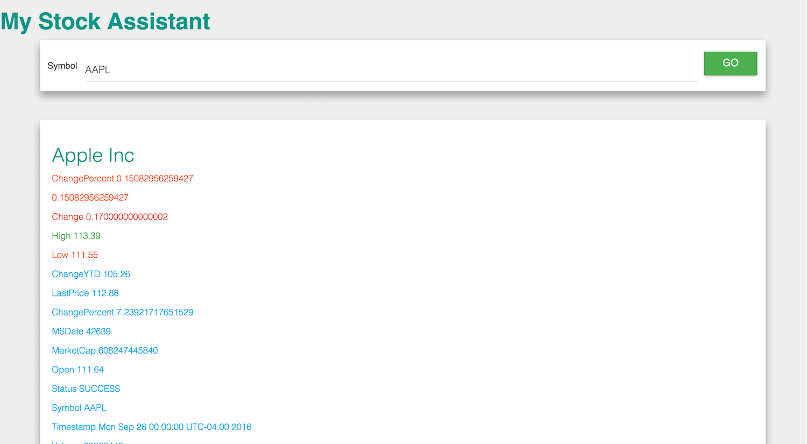

#My Stock Assistant
simple implementation of applicaiton that displays stock quote based on stock Symbol. This Project is built on react and npm with webpack. It uses bootstrap and bootstrap-material-design for styling.

#Example

#Running locally
1. Clone the repository

2. Install the Node dependencies.

        npm install
3. Building the npm module

        npm run build
4. Run the application
        
        npm run start
 hit localhost:8080 on your browser to get going.

#Testing
All tests are written using [Jest](https://facebook.github.io/jest/). All tests are saved in `src/__test__`. Tests can be run locally using the following command
        
        npm test

## Contributing

1. Fork it ( https://github.com/[my-github-username]/my-stock-assistant/fork )
2. Create your feature branch (`git checkout -b my-new-feature`)
3. Commit your changes (`git commit -am 'Add some feature'`)
4. Push to the branch (`git push origin my-new-feature`)
5. Create a new Pull Request

## License

Released under the MIT License. See the [LICENSE][] file for further details.

[license]: LICENSE
